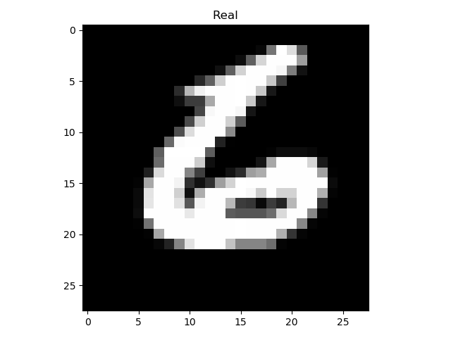
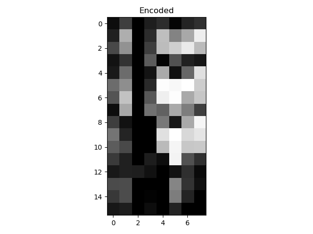
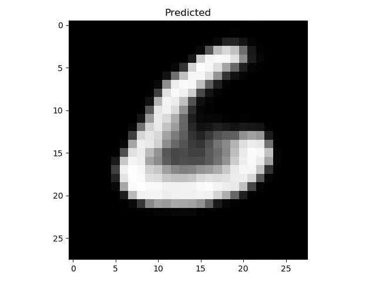
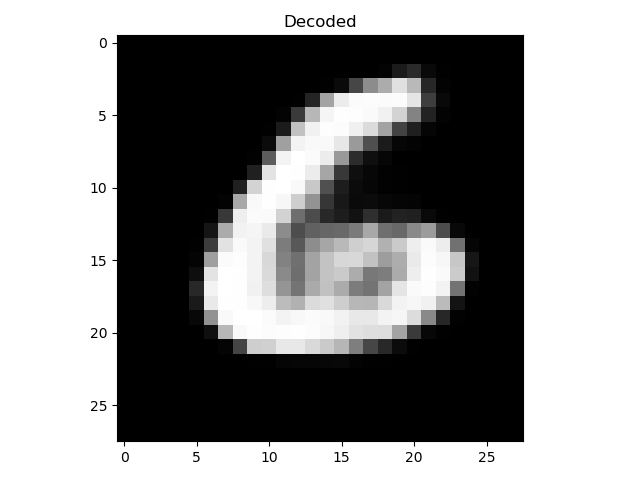

# GANsPlusAutoEncoder

AutoEncoder part of the project is almost done.
The file which is `main.py` encodes mnist dataset 
and produces an encoded numpy array. After that if 
you want to decode the numpy array then you can..

| Real | Encoded | Predicted | Decoded |
:-------------------------:|:-------------------------:|:-------------------------:|:-------------------------: 
 |  |  |  |
The NNs which helped them to be produced are trained 100 epoch.

**Predicted** one is predicted from encoded image by another 
neural network which is trained by using predicted images (encoded)
from first autoencoder neural network and test images.  

**Decoded** one is basically predicted by using 
the autoencoder neural network which is the main neural network
to encode and then decode the images but even though it does both job,
we need just the first one: Encoding.